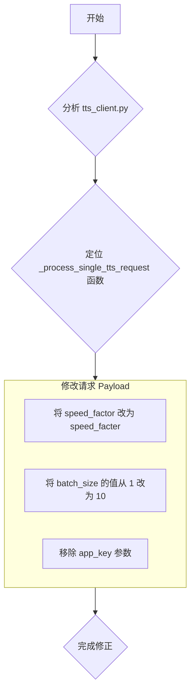

# `tts_client.py` 参数错误修正计划

## 1. 问题背景

在调用 `batch_tts` 接口时，外部 API 返回“参数错误”。通过比对 `tts_client.py` 中构造的请求体与 API 提供的成功示例，发现了多处不一致。

## 2. 问题分析

以下是代码与 API 示例之间的关键差异：

| 参数 | 代码中的实现 (`tts_client.py`) | API 成功示例 | 问题 |
| :--- | :--- | :--- | :--- |
| **`speed_factor`** | `speed_factor` | `speed_facter` | 拼写错误 |
| **`batch_size`** | `1` (硬编码) | `10` | 数值不匹配 |
| **`app_key`** | `""` (空字符串) | 不存在此参数 | 包含了多余的参数 |
| **`text_lang`** | 默认值为 `"中英混合"` | `"中文"` | 默认值可能不正确 |

## 3. 修正计划

为了解决上述问题，需要对 `tts_client.py` 文件中的 `_process_single_tts_request` 函数进行修改。

### 具体的代码修改点:

1.  **修正 `speed_factor`**:
    *   **文件**: `tts_client.py`
    *   **行号**: 24
    *   **修改前**: `"speed_factor": req.get("speed_factor", 1),`
    *   **修改后**: `"speed_facter": req.get("speed_factor", 1),`

2.  **调整 `batch_size`**:
    *   **文件**: `tts_client.py`
    *   **行号**: 32
    *   **修改前**: `"batch_size": 1,`
    *   **修改后**: `"batch_size": 10,`

3.  **移除 `app_key`**:
    *   **文件**: `tts_client.py`
    *   **行号**: 42
    *   **操作**: 删除整行 `"app_key": "",`。

## 4. 下一步

在您确认此计划后，我将请求切换到“代码”模式以应用这些修改。